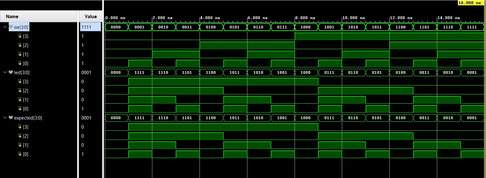

# Resultados de Simulación 

## Descripción del Testbench

Se desarrolló un testbench autocheck que recorre las 16 combinaciones posibles de un bus de 4 bits (0000 a 1111).

Para cada valor de entrada:

- Se asigna el valor al bus "sw".
- Se calcula el complemento a 2 esperado mediante la expresión:
  
  Y = (~X) + 1

- Se compara el valor generado por el módulo ("led") con el valor teórico ("expected").
- En caso de discrepancia, el testbench genera un error y finaliza la simulación.

La simulación confirma que el módulo implementa correctamente el complemento a 2 en 4 bits.

---

## Captura de simulación

## Conclusión

La comparación entre "led" y "expected" no presentó errores durante la simulación, validando el correcto funcionamiento del módulo combinacional.
