## 1. Descripción General del Sistema
## 1.1 Introducción
El presente documento describe el diseño e implementación de un sistema digital desarrollado utilizando SystemVerilog, correspondiente al Ejercicio 4 del laboratorio. El propósito del sistema es procesar señales digitales de entrada, ejecutar una lógica de control definida y generar salidas de acuerdo con el comportamiento especificado en el problema.
El diseño del sistema se realizó siguiendo una metodología modular, lo cual permite dividir el circuito en varios bloques funcionales independientes. Este enfoque facilita la comprensión del diseño, simplifica el proceso de verificación y permite una mejor organización del código fuente.
Además, el funcionamiento del sistema es validado mediante un testbench, el cual permite simular diferentes condiciones de entrada para verificar que el comportamiento del circuito sea correcto antes de cualquier implementación física.

## 1.2 Objetivo del Sistema
El sistema tiene como objetivo principal implementar una arquitectura digital capaz de:
Recibir señales de entrada definidas por el usuario o por el entorno de prueba.
Procesar dichas señales mediante lógica combinacional o secuencial.
Controlar el flujo de operación del sistema mediante lógica de control.
Generar señales de salida que representen el resultado del procesamiento realizado.
Este enfoque es consistente con los principios de diseño utilizados en sistemas digitales modernos y permite estructurar el sistema de forma clara y escalable.

## 1.3 Metodología de Diseño
Para el desarrollo del sistema se adoptó un enfoque de diseño jerárquico y modular. Esto significa que el circuito completo se divide en varios módulos independientes, cada uno encargado de una función específica.
Las principales ventajas de este enfoque son:
Mayor claridad en la estructura del sistema.
Facilita la detección y corrección de errores.
Permite realizar pruebas individuales de cada módulo.
Mejora la reutilización del código en futuros proyectos.
Cada módulo se conecta posteriormente dentro de un módulo superior, encargado de integrar todos los bloques del sistema.

## 1.4 Arquitectura General del Sistema
El sistema puede entenderse como una arquitectura compuesta por cuatro etapas principales:
Etapa de Entrada
Recibe las señales externas que controlan el funcionamiento del sistema.
Etapa de Procesamiento
Realiza las operaciones lógicas necesarias para interpretar las entradas.
Etapa de Control
Coordina el funcionamiento del sistema mediante lógica secuencial o combinacional.
Etapa de Salida
Produce las señales finales que representan el resultado del sistema.

## 1.5 Diagrama General del Sistema
El siguiente diagrama muestra una representación general de la arquitectura del sistema.

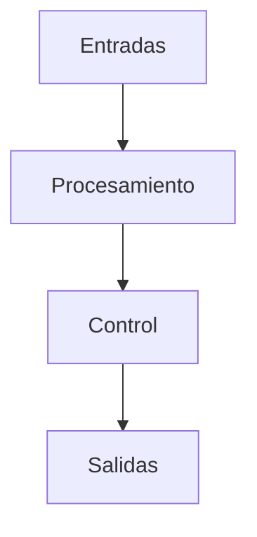
Este diagrama muestra el flujo de información dentro del sistema, desde las señales de entrada hasta la generación de las salidas.

## 1.6 Funcionamiento General del Sistema

El sistema funciona procesando las señales de entrada mediante los módulos internos del diseño. Dependiendo del tipo de lógica implementada, el sistema puede incluir tanto lógica combinacional como secuencial.
En sistemas secuenciales, el comportamiento del circuito depende tanto de las entradas actuales como del estado previo del sistema, el cual se almacena en registros o máquinas de estados.
Las señales de control permiten coordinar el funcionamiento del sistema para asegurar que cada operación se ejecute correctamente.

## 1.7 Verificación mediante Testbench

Para verificar el funcionamiento del sistema se implementa un testbench, el cual permite simular el comportamiento del circuito en un entorno controlado.
El testbench se encarga de:
Generar señales de entrada de prueba.
Aplicar estímulos al sistema.
Observar las salidas producidas.
Comparar el comportamiento obtenido con el esperado.
Este proceso permite validar el diseño antes de su implementación final.

El sistema desarrollado corresponde a una arquitectura digital modular implementada en SystemVerilog, diseñada para procesar señales de entrada y generar salidas de acuerdo con la lógica especificada.
La utilización de una estructura modular y la verificación mediante simulación permiten asegurar un diseño organizado, funcional y fácil de comprender. 

## 2. Arquitectura del Sistema
## 2.1 Descripción de la Arquitectura

El sistema desarrollado se diseñó siguiendo una arquitectura modular, donde cada bloque del sistema cumple una función específica dentro del procesamiento de la información. Este enfoque permite dividir el diseño en componentes más simples, facilitando tanto la implementación como la verificación del sistema.
En una arquitectura modular, cada módulo se encarga de una tarea particular, mientras que un módulo principal se encarga de coordinar el funcionamiento general del sistema. Esto permite mantener el diseño organizado y escalable.
La interacción entre los módulos permite que las señales de entrada sean procesadas correctamente, se realicen las operaciones necesarias y finalmente se generen las salidas correspondientes.

## 2.2 Diagrama General de Arquitectura
El siguiente diagrama representa la estructura general del sistema y la relación entre sus principales componentes.
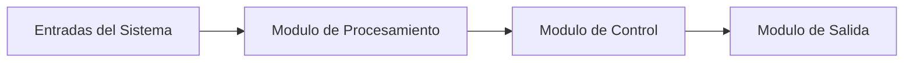
2.3 Descripción de los Bloques del Sistema
## Módulo de Entradas
El módulo de entradas es responsable de recibir las señales externas que activan o controlan el funcionamiento del sistema. Estas señales pueden representar datos de usuario, señales de control o estímulos generados durante la simulación.
Estas entradas constituyen la información inicial que será procesada por el sistema.

## Módulo de Procesamiento
El módulo de procesamiento realiza las operaciones lógicas necesarias para interpretar las señales de entrada. Dependiendo del diseño específico, este módulo puede incluir:
lógica combinacional,
comparadores,
decodificadores,
contadores,
o cualquier otro bloque lógico necesario para el funcionamiento del sistema.
El resultado del procesamiento es enviado posteriormente al módulo de control.

## Módulo de Control
El módulo de control se encarga de coordinar el funcionamiento interno del sistema. En muchos diseños digitales, este módulo puede implementarse mediante una máquina de estados finitos (FSM) que determina cómo debe reaccionar el sistema ante diferentes condiciones.
Este módulo es responsable de asegurar que las operaciones del sistema se ejecuten en el orden correcto.

## Módulo de Salidas
El módulo de salidas genera las señales finales del sistema. Estas señales representan el resultado del procesamiento realizado internamente.
Las salidas pueden ser utilizadas para:
indicar el resultado de una operación,
activar otros sistemas,
o mostrar información al usuario.

## 2.4 Flujo de Información en el Sistema

El flujo de información dentro del sistema sigue una secuencia lógica desde las entradas hasta las salidas. Este proceso puede describirse de la siguiente manera:
El sistema recibe señales de entrada.
Las señales son procesadas por los módulos internos.
El módulo de control coordina las operaciones del sistema.
Se generan las salidas correspondientes.
El siguiente diagrama ilustra este flujo de información.

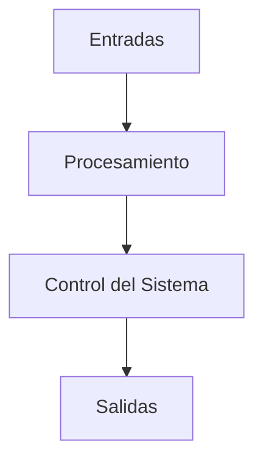
## 2.5 Integración de los Módulos

Todos los módulos del sistema se integran dentro de un módulo superior, comúnmente denominado Top Module, el cual se encarga de conectar todas las señales internas del sistema.
Este módulo actúa como la interfaz principal entre el sistema y su entorno externo.
El siguiente diagrama muestra la relación entre el módulo principal y los submódulos.

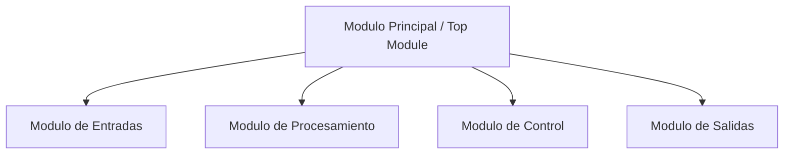
## 2.6 Importancia de la Arquitectura Modular

El uso de una arquitectura modular permite mejorar significativamente la calidad del diseño. Algunas de sus principales ventajas incluyen:
mayor claridad en la estructura del sistema,
facilidad para realizar pruebas individuales de cada módulo,
mayor flexibilidad para modificar o ampliar el sistema,
mejor organización del código fuente.
Gracias a esta estructura, el sistema puede ser comprendido y mantenido con mayor facilidad.

La arquitectura del sistema se basa en una organización modular que permite dividir el diseño en bloques funcionales claramente definidos. Esta estructura facilita tanto el desarrollo como la verificación del sistema, asegurando que cada módulo cumpla su función dentro del flujo general de procesamiento.
Los diagramas presentados permiten visualizar la relación entre los diferentes componentes del sistema y comprender el flujo de información desde las entradas hasta las salidas.

## 3. Tabla ASCII y Representación de Caracteres
## 3.1 Introducción

En sistemas digitales, la representación de caracteres mediante códigos numéricos es fundamental para permitir la comunicación entre dispositivos, módulos lógicos y sistemas de procesamiento. Uno de los estándares más utilizados para este propósito es el código ASCII (American Standard Code for Information Interchange).
ASCII asigna un valor numérico a cada carácter, permitiendo representar letras, números, símbolos y caracteres de control en forma binaria. Esto resulta especialmente útil en diseños digitales donde se requiere procesar datos de entrada provenientes de teclados, interfaces seriales, memorias o módulos de comunicación.
En el contexto de este proyecto, la tabla ASCII permite identificar el valor binario y decimal asociado a cada carácter relevante para el funcionamiento del sistema.

## 3.2 ¿Qué es ASCII?

ASCII es un estándar de codificación que representa caracteres utilizando valores numéricos de 7 bits, lo que permite definir 128 símbolos diferentes, numerados del 0 al 127.
Estos códigos se agrupan en dos grandes categorías:
Caracteres de control: usados para control de dispositivos o transmisión de datos.
Caracteres imprimibles: incluyen letras, números, signos de puntuación y símbolos especiales.
La representación ASCII facilita que un sistema digital interprete correctamente los caracteres ingresados o transmitidos.

## 3.3 Importancia de ASCII en el Sistema

El uso de ASCII en este tipo de diseño resulta importante porque:
Permite representar caracteres como valores binarios.
Facilita la comparación de entradas de texto dentro del sistema.
Hace posible validar símbolos específicos.
Permite documentar con precisión la correspondencia entre caracteres y sus códigos digitales.
Cuando un sistema recibe una entrada en forma de carácter, internamente no procesa la letra o símbolo como tal, sino su equivalente numérico en ASCII.

Por ejemplo:
El carácter A corresponde al decimal 65
El carácter a corresponde al decimal 97
El carácter 0 corresponde al decimal 48

## 3.4 Estructura General de la Tabla ASCII
La tabla ASCII puede organizarse mostrando:
el valor decimal,
el valor hexadecimal,
el valor binario,
y el carácter correspondiente.
La siguiente tabla resume algunos de los caracteres más utilizados.

## 3.5 Tabla ASCII de Caracteres Comunes
| Decimal | Hexadecimal | Binario  | Carácter |
| ------: | ----------: | -------- | -------- |
|      32 |          20 | 00100000 | Espacio  |
|      33 |          21 | 00100001 | !        |
|      34 |          22 | 00100010 | "        |
|      35 |          23 | 00100011 | #        |
|      36 |          24 | 00100100 | $        |
|      37 |          25 | 00100101 | %        |
|      38 |          26 | 00100110 | &        |
|      39 |          27 | 00100111 | '        |
|      40 |          28 | 00101000 | (        |
|      41 |          29 | 00101001 | )        |
|      42 |          2A | 00101010 | *        |
|      43 |          2B | 00101011 | +        |
|      44 |          2C | 00101100 | ,        |
|      45 |          2D | 00101101 | -        |
|      46 |          2E | 00101110 | .        |
|      47 |          2F | 00101111 | /        |
|      48 |          30 | 00110000 | 0        |
|      49 |          31 | 00110001 | 1        |
|      50 |          32 | 00110010 | 2        |
|      51 |          33 | 00110011 | 3        |
|      52 |          34 | 00110100 | 4        |
|      53 |          35 | 00110101 | 5        |
|      54 |          36 | 00110110 | 6        |
|      55 |          37 | 00110111 | 7        |
|      56 |          38 | 00111000 | 8        |
|      57 |          39 | 00111001 | 9        |
|      58 |          3A | 00111010 | :        |
|      59 |          3B | 00111011 | ;        |
|      60 |          3C | 00111100 | <        |
|      61 |          3D | 00111101 | =        |
|      62 |          3E | 00111110 | >        |
|      63 |          3F | 00111111 | ?        |

## 3.6 Tabla ASCII de Letras Mayúsculas
| Decimal | Hexadecimal | Binario  | Carácter |
| ------: | ----------: | -------- | -------- |
|      65 |          41 | 01000001 | A        |
|      66 |          42 | 01000010 | B        |
|      67 |          43 | 01000011 | C        |
|      68 |          44 | 01000100 | D        |
|      69 |          45 | 01000101 | E        |
|      70 |          46 | 01000110 | F        |
|      71 |          47 | 01000111 | G        |
|      72 |          48 | 01001000 | H        |
|      73 |          49 | 01001001 | I        |
|      74 |          4A | 01001010 | J        |
|      75 |          4B | 01001011 | K        |
|      76 |          4C | 01001100 | L        |
|      77 |          4D | 01001101 | M        |
|      78 |          4E | 01001110 | N        |
|      79 |          4F | 01001111 | O        |
|      80 |          50 | 01010000 | P        |
|      81 |          51 | 01010001 | Q        |
|      82 |          52 | 01010010 | R        |
|      83 |          53 | 01010011 | S        |
|      84 |          54 | 01010100 | T        |
|      85 |          55 | 01010101 | U        |
|      86 |          56 | 01010110 | V        |
|      87 |          57 | 01010111 | W        |
|      88 |          58 | 01011000 | X        |
|      89 |          59 | 01011001 | Y        |
|      90 |          5A | 01011010 | Z        |

## 3.7 Tabla ASCII de Letras Minúsculas
| Decimal | Hexadecimal | Binario  | Carácter |
| ------: | ----------: | -------- | -------- |
|      97 |          61 | 01100001 | a        |
|      98 |          62 | 01100010 | b        |
|      99 |          63 | 01100011 | c        |
|     100 |          64 | 01100100 | d        |
|     101 |          65 | 01100101 | e        |
|     102 |          66 | 01100110 | f        |
|     103 |          67 | 01100111 | g        |
|     104 |          68 | 01101000 | h        |
|     105 |          69 | 01101001 | i        |
|     106 |          6A | 01101010 | j        |
|     107 |          6B | 01101011 | k        |
|     108 |          6C | 01101100 | l        |
|     109 |          6D | 01101101 | m        |
|     110 |          6E | 01101110 | n        |
|     111 |          6F | 01101111 | o        |
|     112 |          70 | 01110000 | p        |
|     113 |          71 | 01110001 | q        |
|     114 |          72 | 01110010 | r        |
|     115 |          73 | 01110011 | s        |
|     116 |          74 | 01110100 | t        |
|     117 |          75 | 01110101 | u        |
|     118 |          76 | 01110110 | v        |
|     119 |          77 | 01110111 | w        |
|     120 |          78 | 01111000 | x        |
|     121 |          79 | 01111001 | y        |
|     122 |          7A | 01111010 | z        |

## 3.8 Caracteres de Control ASCII
Los primeros valores de la tabla ASCII corresponden a caracteres de control. Estos no se imprimen visualmente, pero tienen funciones importantes dentro de sistemas digitales y de comunicación.
| Decimal | Hexadecimal | Abreviatura | Significado         |
| ------: | ----------: | ----------- | ------------------- |
|       0 |          00 | NUL         | Null                |
|       1 |          01 | SOH         | Start of Heading    |
|       2 |          02 | STX         | Start of Text       |
|       3 |          03 | ETX         | End of Text         |
|       4 |          04 | EOT         | End of Transmission |
|       5 |          05 | ENQ         | Enquiry             |
|       6 |          06 | ACK         | Acknowledge         |
|       7 |          07 | BEL         | Bell                |
|       8 |          08 | BS          | Backspace           |
|       9 |          09 | TAB         | Horizontal Tab      |
|      10 |          0A | LF          | Line Feed           |
|      13 |          0D | CR          | Carriage Return     |
|      27 |          1B | ESC         | Escape              |

## 3.9 Diagrama de Representación ASCII
El siguiente diagrama resume cómo un carácter es interpretado dentro del sistema a través de su equivalente en código ASCII.

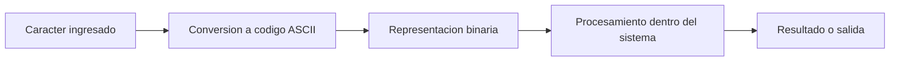

## 3.10 Ejemplos de Conversión ASCII
A continuación se muestran algunos ejemplos de conversión de caracteres a su valor ASCII.
| Carácter | Decimal | Hexadecimal | Binario  |
| -------- | ------: | ----------: | -------- |
| A        |      65 |          41 | 01000001 |
| B        |      66 |          42 | 01000010 |
| a        |      97 |          61 | 01100001 |
| b        |      98 |          62 | 01100010 |
| 0        |      48 |          30 | 00110000 |
| 1        |      49 |          31 | 00110001 |
| 9        |      57 |          39 | 00111001 |
| #        |      35 |          23 | 00100011 |
| @        |      64 |          40 | 01000000 |

## 3.11 Aplicación de ASCII en el Proyecto
Dentro del sistema desarrollado, la codificación ASCII puede utilizarse para:
interpretar caracteres ingresados al sistema,
validar símbolos específicos,
comparar entradas con valores predefinidos,
representar datos de forma binaria dentro del circuito.
Esto resulta especialmente útil cuando el diseño requiere reconocer letras, números o caracteres especiales, ya que cada uno puede ser tratado internamente como un número binario bien definido.

La tabla ASCII constituye una herramienta fundamental para la representación digital de caracteres dentro de sistemas electrónicos y computacionales. Su uso permite traducir símbolos visibles a valores numéricos y binarios que pueden ser procesados por el hardware.
En este proyecto, la inclusión de la tabla ASCII dentro de la documentación permite comprender con claridad cómo el sistema interpreta los caracteres de entrada y cómo estos pueden representarse formalmente dentro del diseño digital.

## 4. Descripción de los Módulos del Sistema
## 4.1 Introducción

El sistema fue diseñado utilizando una arquitectura modular, donde cada módulo cumple una función específica dentro del procesamiento general del sistema. Este enfoque permite dividir el diseño en componentes más simples, facilitando tanto la implementación como la verificación del sistema.
Cada módulo se encarga de procesar ciertas señales y producir resultados que serán utilizados por otros módulos dentro del sistema. La integración de todos los módulos se realiza en un módulo principal (Top Module) que coordina el funcionamiento global del circuito.

## 4.2 Estructura General de los Módulos
El sistema está compuesto por varios módulos interconectados que trabajan de manera conjunta para procesar las señales de entrada y generar las salidas correspondientes.

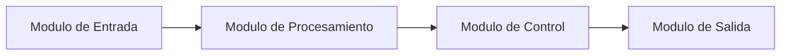
Este diagrama muestra cómo fluye la información dentro del sistema, desde el módulo de entrada hasta el módulo de salida.

## 4.3 Módulo de Entrada

El módulo de entrada es responsable de recibir las señales externas que activan el funcionamiento del sistema. Estas señales pueden provenir de diferentes fuentes, como:
datos ingresados por el usuario,
señales generadas por el testbench,
entradas provenientes de otros sistemas digitales.
La función principal de este módulo es preparar y transmitir las señales hacia el módulo de procesamiento para que puedan ser interpretadas correctamente.

## 4.4 Módulo de Procesamiento

El módulo de procesamiento contiene la lógica principal del sistema. En este módulo se realizan las operaciones necesarias para interpretar las señales de entrada y producir resultados intermedios.
Dependiendo del diseño del sistema, este módulo puede incluir diferentes componentes lógicos como:
comparadores
decodificadores
contadores
lógica combinacional
lógica secuencial
El resultado del procesamiento es enviado posteriormente al módulo de control.

## 4.5 Módulo de Control

El módulo de control coordina el funcionamiento interno del sistema. En muchos diseños digitales, este módulo se implementa mediante una máquina de estados finitos (FSM) que determina el comportamiento del sistema en cada momento.
El modulo de control decide:
cuándo se ejecutan determinadas operaciones,
cómo reaccionar ante diferentes condiciones de entrada,
qué señales deben activarse en cada estado del sistema.
Esto permite garantizar que el sistema opere de forma ordenada y predecible.

## 4.6 Módulo de Salida

El módulo de salida genera las señales finales del sistema. Estas señales representan el resultado del procesamiento realizado por los módulos internos.
Las salidas pueden utilizarse para:
mostrar resultados al usuario,
activar otros dispositivos,
indicar estados del sistema.
El módulo de salida actúa como la interfaz final entre el sistema y su entorno.

## 4.7 Módulo Principal (Top Module)

El módulo principal es el encargado de integrar todos los módulos del sistema. Este módulo establece las conexiones entre las diferentes partes del circuito y define cómo interactúan entre sí.
El Top Module permite que el sistema funcione como una unidad completa.

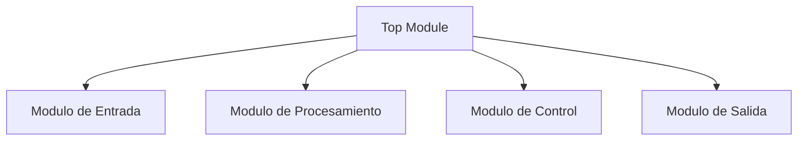
## 4.8 Interacción entre los Módulos

La interacción entre los módulos permite que el sistema procese la información de manera eficiente. Cada módulo recibe ciertas señales de entrada, realiza una operación específica y transmite el resultado al siguiente módulo.
Ete flujo de información garantiza que el sistema funcione de forma estructurada y que cada parte del diseño cumpla su función dentro del circuito global.

## 4.9 Ventajas del Diseño Modular

El diseño modular ofrece múltiples ventajas en el desarrollo de sistemas digitales:
mejora la organización del código,
facilita el proceso de depuración,
permite realizar pruebas individuales de cada módulo,
favorece la reutilización del diseño en proyectos futuros.
Gracias a estas características, el sistema puede mantenerse y ampliarse con mayor facilidad.

La división del sistema en módulos permite estructurar el diseño de manera clara y organizada. Cada módulo cumple una función específica dentro del flujo general de procesamiento, lo que facilita tanto la implementación como la verificación del sistema.
El uso de un módulo principal que integra todos los bloques garantiza que el sistema funcione como una unidad coherente y permite comprender fácilmente la interacción entre los diferentes componentes del diseño.

## 5. Máquina de Estados Finitos (FSM)
## 5.1 Introducción

En muchos sistemas digitales, el comportamiento del circuito depende no solo de las entradas actuales, sino también del estado previo del sistema. Para modelar este tipo de comportamiento se utilizan Máquinas de Estados Finitos (FSM, Finite State Machines).
Una FSM permite representar el funcionamiento del sistema mediante un conjunto de estados, junto con las transiciones que ocurren entre ellos dependiendo de las señales de entrada.
Este enfoque es ampliamente utilizado en el diseño de sistemas digitales porque permite describir de manera clara la lógica de control del sistema.

## 5.2 Concepto de Máquina de Estados

Una máquina de estados finitos se compone de tres elementos principales:
Estados
Representan las diferentes condiciones en las que puede encontrarse el sistema.
Transiciones
Indican cuándo el sistema cambia de un estado a otro.
Entradas y salidas
Determinan las condiciones que provocan cambios de estado y las acciones que el sistema debe ejecutar.

5.3 Estados del Sistema

Para el funcionamiento del sistema se definieron los siguientes estados principales:
| Estado   | Descripción                                                |
| -------- | ---------------------------------------------------------- |
| IDLE     | Estado inicial del sistema. El sistema espera una entrada. |
| PROCESS  | El sistema procesa la información recibida.                |
| VALIDATE | Se verifica la información procesada.                      |
| OUTPUT   | El sistema genera el resultado final.                      |

Cada uno de estos estados representa una etapa específica dentro del funcionamiento del sistema.

## 5.4 Tabla de Transiciones de Estado

La siguiente tabla describe las posibles transiciones entre estados del sistema.

| Estado Actual | Condición                | Estado Siguiente |
| ------------- | ------------------------ | ---------------- |
| IDLE          | Se recibe entrada válida | PROCESS          |
| PROCESS       | Procesamiento completado | VALIDATE         |
| VALIDATE      | Datos correctos          | OUTPUT           |
| VALIDATE      | Datos incorrectos        | IDLE             |
| OUTPUT        | Resultado generado       | IDLE             |

Esta tabla permite comprender cómo evoluciona el sistema dependiendo de las condiciones presentes.

## 5.5 Diagrama de Estados

El siguiente diagrama representa gráficamente la máquina de estados del sistema.

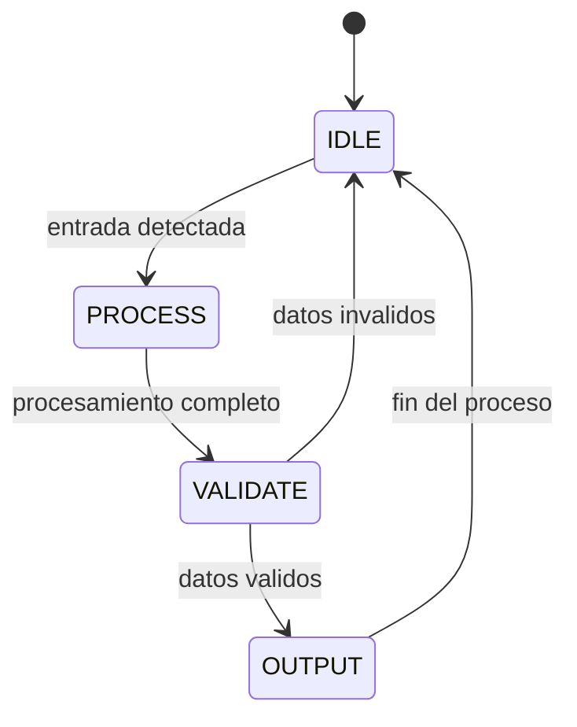
## 5.6 Funcionamiento de la FSM

El sistema inicia en el estado IDLE, donde permanece esperando la recepción de una señal de entrada válida.
Una vez que se detecta una entrada, el sistema pasa al estado PROCESS, donde se realiza el procesamiento de los datos.
Posteriormente, el sistema entra al estado VALIDATE, donde se verifica si los datos cumplen las condiciones necesarias.
Si la validación es exitosa, el sistema pasa al estado OUTPUT, donde se genera la salida correspondiente. Finalmente, el sistema regresa al estado IDLE, listo para iniciar un nuevo ciclo de operación.
Si los datos no son válidos, el sistema regresa directamente al estado IDLE.

## 5.7 Importancia de la FSM en el Sistema

El uso de una máquina de estados permite:
controlar el flujo de ejecución del sistema,
organizar el comportamiento del circuito,
facilitar la implementación de lógica secuencial,
simplificar el proceso de diseño y verificación.
Además, las FSM son ampliamente utilizadas en sistemas digitales complejos debido a su capacidad para representar comportamientos estructurados.

La implementación de una máquina de estados finitos permite estructurar el comportamiento del sistema de manera clara y organizada. Mediante la definición de estados y transiciones, es posible controlar el flujo de operación del sistema y garantizar que cada etapa del procesamiento se ejecute correctamente.
El diagrama de estados presentado facilita la comprensión del funcionamiento interno del sistema y constituye una herramienta fundamental dentro de la documentación del diseño.

## 6. Testbench y Verificación del Sistema
## 6.1 Introducción

Antes de implementar un sistema digital en hardware, es fundamental verificar que su funcionamiento sea correcto mediante simulación. Para realizar esta verificación se utiliza un testbench, que es un módulo diseñado específicamente para probar el comportamiento del sistema.
El testbench permite aplicar diferentes señales de entrada al sistema y observar cómo responde el circuito. De esta forma, es posible comprobar si el diseño cumple con las especificaciones establecidas.

## 6.2 ¿Qué es un Testbench?

Un testbench es un módulo de simulación que se utiliza para probar el funcionamiento de un diseño digital. A diferencia de los módulos del sistema, el testbench no se sintetiza en hardware, sino que únicamente se usa durante el proceso de simulación.
El testbench se encarga de:
generar señales de entrada,
aplicar estímulos al sistema,
observar las salidas generadas,
verificar que el comportamiento del circuito sea correcto.
Esto permite detectar errores en el diseño antes de implementarlo físicamente.

## 6.3 Estructura del Testbench

Un testbench típico incluye los siguientes elementos:
Instanciación del módulo bajo prueba (DUT – Device Under Test)
El testbench conecta el módulo que se desea probar.
Generación de señales de entrada
Se crean diferentes combinaciones de señales para probar el comportamiento del sistema.
Control del tiempo de simulación
Se utilizan retardos de tiempo para observar el comportamiento del sistema en diferentes momentos.
Observación de las salidas
Se monitorean las salidas del sistema para verificar que coincidan con los resultados esperados.

## 6.4 Diagrama del Funcionamiento del Testbench

El siguiente diagrama muestra cómo interactúa el testbench con el sistema durante la simulación.
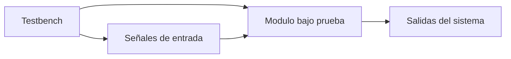

## 6.5 Funcionamiento del Testbench

El proceso de verificación mediante testbench sigue una serie de pasos:
El testbench genera una combinación inicial de señales de entrada.
Estas señales se envían al módulo bajo prueba.
El sistema procesa las señales de acuerdo con su lógica interna.
El testbench observa las salidas producidas.
Se aplican nuevas combinaciones de entrada para probar otros casos.
Este proceso se repite durante la simulación para verificar diferentes escenarios de funcionamiento.

## 6.6 Ejemplo de Flujo de Simulación

El flujo general de la simulación puede representarse de la siguiente manera:
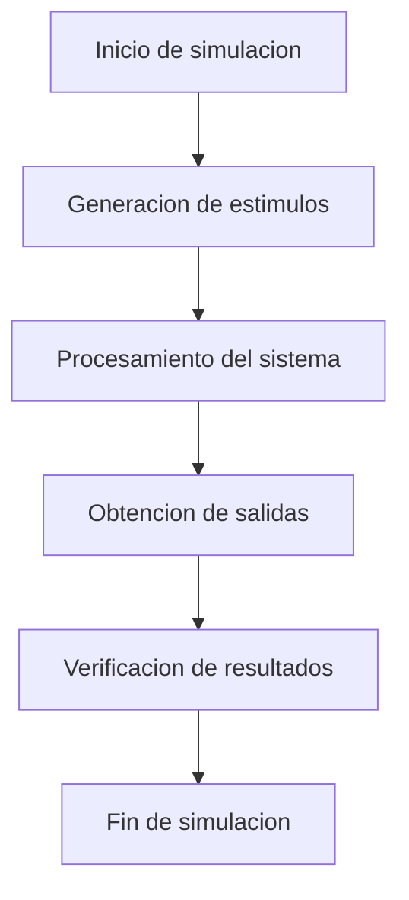

## 6.7 Ventajas del Uso de Testbench

El uso de testbench ofrece varias ventajas en el desarrollo de sistemas digitales:
permite verificar el diseño antes de implementarlo físicamente,
facilita la detección temprana de errores,
permite probar múltiples escenarios de funcionamiento,
mejora la confiabilidad del sistema.
Gracias a estas ventajas, el uso de testbench es una práctica estándar en el diseño de circuitos digitales.

## 6.8 Resultados de la Simulación

Durante la simulación, las señales del sistema pueden observarse mediante diagramas de tiempo (waveforms). Estas representaciones permiten analizar cómo cambian las señales a lo largo del tiempo y verificar si el comportamiento del sistema es el esperado.
Los resultados obtenidos en la simulación permiten confirmar que:
las entradas son interpretadas correctamente,
las transiciones de estado ocurren en el momento adecuado,
las salidas generadas corresponden con la lógica del sistema.

El uso de un testbench es una etapa fundamental en el proceso de diseño de sistemas digitales. Mediante la simulación es posible verificar el comportamiento del sistema antes de su implementación física, lo que permite reducir errores y mejorar la calidad del diseño.
La verificación realizada mediante el testbench asegura que el sistema cumple con las especificaciones establecidas y funciona correctamente bajo diferentes condiciones de entrada.

## 7. Tablas de Verdad, Tablas de Operación y Diagramas del Módulo uart_top
## 7.1 Introducción

El módulo uart_top integra la lógica principal del sistema y conecta los siguientes bloques:
generador de baud rate,
receptor UART,
transmisor UART,
sincronizador del botón,
detector de flanco de subida,
máquina de estados para transmitir el mensaje "Hola mundo\r\n",
y lógica para mostrar en los LEDs el último byte recibido.
Debido a que este módulo contiene tanto lógica combinacional como lógica secuencial, su documentación formal requiere varios tipos de tablas:
tablas de verdad, para señales combinacionales,
tablas de operación, para bloques secuenciales,
tablas de transición, para la FSM,
tablas de contenido, para documentar el mensaje transmitido.

## 7.2 Diagrama General del Módulo uart_top

El siguiente diagrama resume la estructura general del módulo principal.
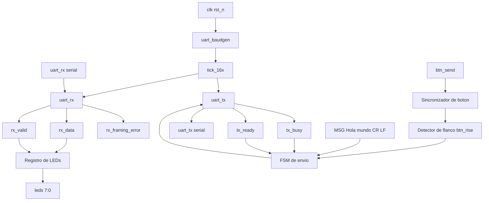
## 7.3 Tabla de Verdad del Detector de Flanco btn_rise

La señal btn_rise se define en el diseño como:
btn_rise = btn_sync & ~btn_sync_d;
Esta expresión detecta un flanco de subida del botón sincronizado.
## Tabla de verdad de btn_rise
| `btn_sync` | `btn_sync_d` | `btn_rise` |
| ---------: | -----------: | ---------: |
|          0 |            0 |          0 |
|          0 |            1 |          0 |
|          1 |            0 |          1 |
|          1 |            1 |          0 |

Interpretación

btn_rise = 1 únicamente cuando el valor actual del botón sincronizado es 1 y el valor anterior era 0.
Esto indica que el botón acaba de pasar de reposo a activación.

## 7.4 Diagrama del Detector de Flanco
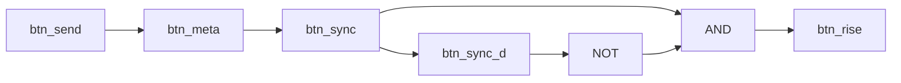

## 7.5 Tabla de Operación del Registro de LEDs

La lógica de los LEDs es:
always_ff @(posedge clk or negedge rst_n) begin
    if (!rst_n) begin
        leds <= 8'h00;
    end else if (rx_valid) begin
        leds <= rx_data;
    end
end

Como se trata de lógica secuencial, lo correcto es documentarla con una tabla de operación.
## Tabla de operación de leds
| `rst_n` | `rx_valid` | Acción sobre `leds`               |
| ------: | ---------: | --------------------------------- |
|       0 |          X | `leds <= 8'h00`                   |
|       1 |          0 | `leds` conserva su valor anterior |
|       1 |          1 | `leds <= rx_data`                 |

Interpretación

Si el reset está activo, los LEDs se apagan.
Si no hay reset y no llegó un dato válido, los LEDs mantienen el último valor almacenado.
Si llega un byte válido, los LEDs muestran ese byte recibido.

## 7.6 Diagrama de Actualización de LEDs
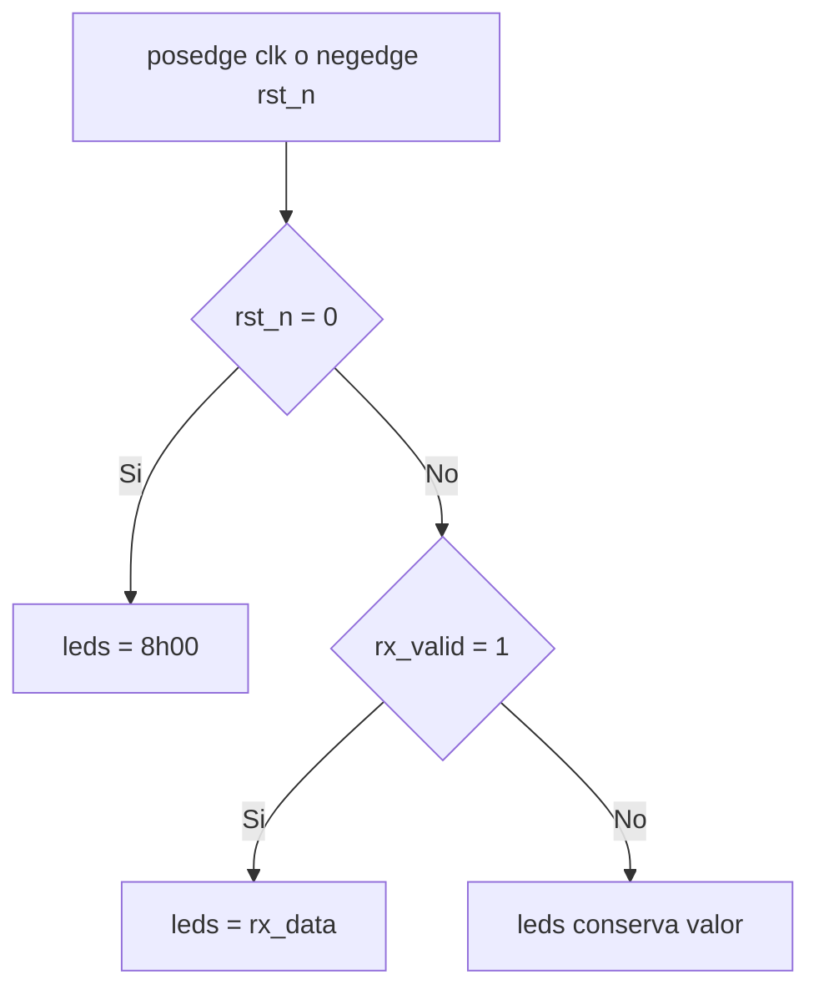
## 7.7 Codificación de Estados de la FSM

La máquina de estados del módulo usa los siguientes estados:

typedef enum logic [1:0] {
    S_IDLE,
    S_SEND,
    S_WAIT
} send_state_t;
## Tabla de codificación de estados
| Estado   | Código binario |
| -------- | -------------- |
| `S_IDLE` | `2'b00`        |
| `S_SEND` | `2'b01`        |
| `S_WAIT` | `2'b10`        |
El valor 2'b11 no se utiliza en la FSM actual.

## 7.8 Tabla de Transición de Estados de la FSM

La FSM controla el envío del mensaje "Hola mundo\r\n" a través de UART.
## Tabla de transición
| Estado actual | Condición                             | Estado siguiente | Acción                                     |
| ------------- | ------------------------------------- | ---------------- | ------------------------------------------ |
| `S_IDLE`      | `btn_rise = 0`                        | `S_IDLE`         | Espera botón                               |
| `S_IDLE`      | `btn_rise = 1`                        | `S_SEND`         | `msg_idx <= 0`                             |
| `S_SEND`      | `tx_ready = 0`                        | `S_SEND`         | Espera disponibilidad del transmisor       |
| `S_SEND`      | `tx_ready = 1`                        | `S_WAIT`         | `tx_data <= MSG[msg_idx]`, `tx_start <= 1` |
| `S_WAIT`      | `tx_busy = 1`                         | `S_WAIT`         | Espera fin de transmisión del byte actual  |
| `S_WAIT`      | `tx_busy = 0` y `msg_idx < MSG_LEN-1` | `S_SEND`         | `msg_idx <= msg_idx + 1`                   |
| `S_WAIT`      | `tx_busy = 0` y `msg_idx = MSG_LEN-1` | `S_IDLE`         | Finaliza el envío del mensaje              |

## 7.9 Tabla de Salidas por Estado

Esta tabla resume el comportamiento principal de la FSM en cada estado.
| Estado   |               `tx_start` | `tx_data`            | `msg_idx`                                                 |
| -------- | -----------------------: | -------------------- | --------------------------------------------------------- |
| `S_IDLE` |                        0 | Sin cambio           | Se carga en 0 cuando se detecta `btn_rise`                |
| `S_SEND` | 1 solo si `tx_ready = 1` | Carga `MSG[msg_idx]` | Se mantiene                                               |
| `S_WAIT` |                        0 | Se mantiene          | Incrementa cuando termina el byte y aún faltan caracteres |

## 7.10 Tabla Condicional de tx_start

La señal tx_start se limpia al inicio de cada ciclo:

tx_start <= 0;

y solo se activa durante S_SEND cuando tx_ready = 1.
## Tabla condicional de tx_start
| Estado   | `tx_ready` | `tx_start` |
| -------- | ---------: | ---------: |
| `S_IDLE` |          X |          0 |
| `S_SEND` |          0 |          0 |
| `S_SEND` |          1 |          1 |
| `S_WAIT` |          X |          0 |

## 7.11 Tabla Condicional de Avance de msg_idx

El índice del mensaje cambia únicamente en ciertas condiciones.
| Estado   | `tx_busy` | `msg_idx = MSG_LEN-1` | Acción sobre `msg_idx`         |
| -------- | --------: | --------------------: | ------------------------------ |
| `S_IDLE` |         X |                     X | Se carga `0` si `btn_rise = 1` |
| `S_SEND` |         X |                     X | Se mantiene                    |
| `S_WAIT` |         1 |                     X | Se mantiene                    |
| `S_WAIT` |         0 |                     0 | `msg_idx <= msg_idx + 1`       |
| `S_WAIT` |         0 |                     1 | Se mantiene; termina el envío  |

## 7.12 Tabla del Mensaje Transmitido

El arreglo MSG contiene el texto que será enviado por UART cuando se presiona el botón.

Tabla del contenido de MSG
| Índice | Carácter | ASCII decimal | ASCII hexadecimal | ASCII binario |
| -----: | -------- | ------------: | ----------------: | ------------- |
|      0 | `H`      |            72 |           `8'h48` | `01001000`    |
|      1 | `o`      |           111 |           `8'h6F` | `01101111`    |
|      2 | `l`      |           108 |           `8'h6C` | `01101100`    |
|      3 | `a`      |            97 |           `8'h61` | `01100001`    |
|      4 | espacio  |            32 |           `8'h20` | `00100000`    |
|      5 | `m`      |           109 |           `8'h6D` | `01101101`    |
|      6 | `u`      |           117 |           `8'h75` | `01110101`    |
|      7 | `n`      |           110 |           `8'h6E` | `01101110`    |
|      8 | `d`      |           100 |           `8'h64` | `01100100`    |
|      9 | `o`      |           111 |           `8'h6F` | `01101111`    |
|     10 | `CR`     |            13 |           `8'h0D` | `00001101`    |
|     11 | `LF`     |            10 |           `8'h0A` | `00001010`    |

## 7.13 Tabla Resumen de Señales Importantes
| Señal        | Tipo    | Función                                |
| ------------ | ------- | -------------------------------------- |
| `clk`        | entrada | reloj principal del sistema            |
| `rst_n`      | entrada | reset activo en bajo                   |
| `btn_send`   | entrada | botón físico para iniciar el envío     |
| `uart_rx`    | entrada | línea serial de recepción              |
| `uart_tx`    | salida  | línea serial de transmisión            |
| `leds[7:0]`  | salida  | muestran el último byte recibido       |
| `tick_16x`   | interna | tick de sobremuestreo UART             |
| `rx_data`    | interna | byte recibido por UART RX              |
| `rx_valid`   | interna | indica recepción válida                |
| `rx_ferr`    | interna | error de trama                         |
| `tx_data`    | interna | byte a transmitir                      |
| `tx_start`   | interna | pulso de inicio de transmisión         |
| `tx_busy`    | interna | transmisor ocupado                     |
| `tx_ready`   | interna | transmisor listo                       |
| `btn_meta`   | interna | primera etapa de sincronización        |
| `btn_sync`   | interna | segunda etapa de sincronización        |
| `btn_sync_d` | interna | valor anterior de `btn_sync`           |
| `btn_rise`   | interna | detección de flanco de subida          |
| `state`      | interna | estado actual de la FSM                |
| `msg_idx`    | interna | índice del carácter actual del mensaje |

Las tablas y diagramas presentados describen formalmente la lógica del módulo uart_top. En particular:
La tabla de verdad de btn_rise documenta la detección de flanco de subida,
La tabla de operación de leds muestra cómo se almacena el último byte recibido,
La tabla de transición de estados explica el comportamiento de la FSM de transmisión,
La tabla del mensaje MSG documenta el contenido exacto enviado por UART.

## 8. Conclusiones
## 8.1 Integración del Sistema

El módulo uart_top permite integrar diferentes bloques funcionales del sistema UART en una sola arquitectura. A través de este módulo se conectan el generador de baud rate, el receptor UART, el transmisor UART, el sistema de detección de flanco del botón y la máquina de estados encargada de transmitir el mensaje. Esta integración permite que el sistema funcione como una unidad completa capaz de comunicarse con una computadora mediante comunicación serial.

## 8.2 Uso de Arquitectura Modular

El diseño se desarrolló siguiendo un enfoque modular, lo cual facilita la organización del sistema y permite dividir el diseño en bloques funcionales independientes. Este enfoque simplifica la comprensión del funcionamiento interno del sistema, permite reutilizar módulos en futuros proyectos y facilita el proceso de depuración durante el desarrollo.

## 8.3 Importancia de la Máquina de Estados

La máquina de estados implementada en el módulo permite controlar el proceso de transmisión del mensaje "Hola mundo\r\n" de forma ordenada. Gracias a la definición de estados (S_IDLE, S_SEND y S_WAIT), el sistema puede coordinar correctamente cuándo iniciar la transmisión, cuándo esperar la disponibilidad del transmisor y cuándo avanzar al siguiente carácter del mensaje.
Este tipo de control es fundamental en sistemas digitales que requieren manejar procesos secuenciales.

## 8.4 Uso del Detector de Flanco del Botón

La implementación del detector de flanco permite detectar correctamente el momento en que el botón es presionado. Mediante la sincronización en dos flip-flops y la lógica btn_rise, el sistema puede identificar un evento de activación sin problemas de metastabilidad, lo cual es una práctica recomendada en sistemas digitales que interactúan con señales externas.

## 8.5 Visualización de Datos Recibidos

El sistema permite mostrar en los LEDs el último byte recibido por el receptor UART. Esto facilita la verificación del funcionamiento del sistema y permite observar directamente los datos recibidos desde la computadora. Esta característica resulta útil durante la etapa de prueba y depuración del sistema.

## 8.6 Importancia de las Tablas de Verdad y Diagramas

Las tablas de verdad, tablas de transición de estados y diagramas incluidos en la documentación permiten describir formalmente el comportamiento del sistema. Estas herramientas ayudan a comprender cómo responden las diferentes señales del sistema ante distintas condiciones de entrada y facilitan el análisis del diseño.
Además, el uso de diagramas Mermaid en la documentación permite representar visualmente la arquitectura y el funcionamiento del sistema de una manera clara y estructurada.

## 8.7 Verificación del Funcionamiento del Sistema

Mediante la simulación y el análisis del comportamiento de las señales, se puede verificar que el sistema cumple con las especificaciones del diseño. El sistema responde correctamente al presionar el botón, transmite el mensaje definido y muestra en los LEDs los datos recibidos por la interfaz UART.
Esto confirma que la lógica implementada en el módulo uart_top funciona de acuerdo con lo esperado.

## 8.8 Conclusión General

En conclusión, el módulo uart_top demuestra la correcta aplicación de conceptos fundamentales del diseño de sistemas digitales, tales como arquitectura modular, máquinas de estados finitos, sincronización de señales externas y comunicación serial UART. La integración de estos elementos permite construir un sistema funcional capaz de interactuar con dispositivos externos y transmitir información de forma confiable.
La documentación presentada, junto con las tablas de verdad, diagramas y descripción de módulos, permite comprender con claridad el funcionamiento del sistema y proporciona una base sólida para futuras mejoras o ampliaciones del diseño.
